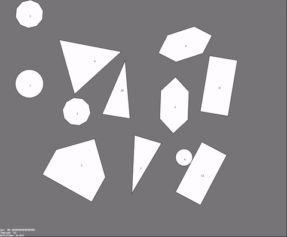

# Collision-MTV
MTV (Minimum Translation Vector):
- Online demo : [here](https://davidhsu666.com/downloads/Collision-MTV/demo/)
- article : [遊戲中的碰撞檢測Collision Detection](http://davidhsu666.com/archives/gamecollisiondetection/)


## Introduction

透過分離軸檢測(SAT)找出兩物體穿透後最小的推出向量(MTV)，來將重疊物體分離



## How to use

`var shapes = [];`

建立N多邊形
```js
shapes.push(new Polygon(pos, verticesRef, rotation));
/*
 pos: Vector(x, y)
 verticesRef: [ new Vector(100, -50),
                new Vector(100, 50),
                new Vector(-100, 0)]
 rotation: 0~2pi
*/
```

建立圓形
```js
shapes.push(new Circle(pos, radius, rotation));
/*
 pos: Vector(x, y)
 radius: circle radius
 rotation: 0~2pi
*/
```

使用方式，檢測上述兩個物體

```js

let result = shapes[i].collideWith(shapes[j]);
if (result.axis) {
    // 表示碰撞成立，執行關於碰撞的邏輯
    // ...
    // 如果需要將兩物體分離，則呼叫separate
    separate(shapes[i], shapes[j], result);
}
```

---


testcase/MTV-2Rects


testcase/MTV-multiPolygons

